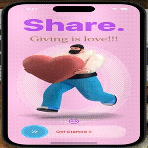

# Restart

Restart is a trendy onboarding view using SwiftUI.

Features covered:

i)Drag Gesture

ii)Haptic Feedback

iii)Status bar style

iv)Animation

v)Reusable component creation

vi)Local Data Storage

vii)State Preservation

viii)Play audio

